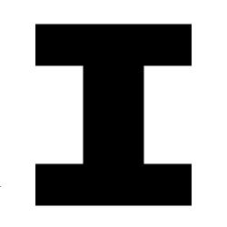

# Marker Based Augmented Reality 
>This is a basic marker based Augmented Reality software built with Python. A marker image is tracked in order to trigger and display an image where it is located.

## Dependencies
The libraries needed in order to run this code:
* `os`
* `unittest` (used for testing, not needed for the program's functionality)
* `OpenCV`

## Run
Run `main.py`.

This software uses a template/marker image named `marker.jpeg`. This marker can be either printed or displayed on a different screen so the camera can identify it.

The images that will be displayed by the software are found in `/images` folder. 

When running the code, the webcam of your machine is activated.

To close it, press `Esc` button.

To switch between posters, press the right and left arrow keys.

Here is a preview:

## Version
This is a first version of this project.

The code and search functions are not optimized. This might cause a low frame rate.
